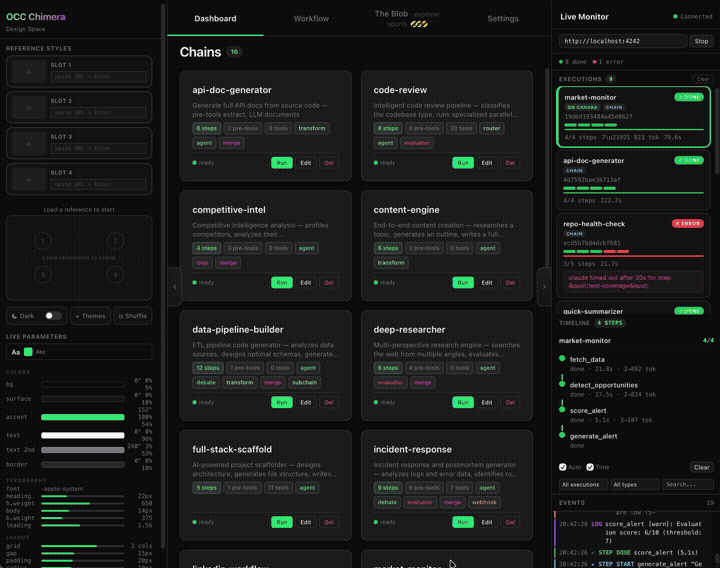

# OCC — Claude Chain Orchestrator

[](https://www.npmjs.com/package/occ-orchestrator)
[](https://www.npmjs.com/package/occ-orchestrator)
[](LICENSE)
[](https://github.com/lacausecrypto/OCC/actions)
[](https://nodejs.org)
[](https://www.typescriptlang.org)
[](https://modelcontextprotocol.io)
[](#pre-tools)
[](#rest-api-102-endpoints)
[](#tests)
[](Dockerfile)
[](#)
[](#)
[](https://claude.ai)

Multi-model workflow engine built on Claude. Define chains in YAML, run them with parallel execution, build visually in a React canvas, access via MCP, REST API, or CLI.

<p align="center">
  
</p>

---

## Table of Contents

- [What is OCC?](#what-is-occ)
- [Quick Start](#quick-start)
- [Chain Format](#chain-format) — step types, pre-tools, advanced config
- [Frontend (Chimera)](#frontend-chimera) — canvas, workflow chat, monitor, BLOB
- [Pipelines](#pipeline-format) — multi-chain orchestration
- [BLOB Sessions](#blob-sessions) — autonomous exploratory AI
- [Scheduling](#scheduled-execution) · [Knowledge Graph](#knowledge-graph) · [CLI](#cli)
- [REST API (102 endpoints)](#rest-api-102-endpoints) — auth, rate limiting
- [Benchmarks](#benchmarks) — OCC vs raw API, economy of scale
- [Deployment](#deployment-on-a-vps) · [Security](SECURITY.md) · [Configuration](#configuration)
- [Example Chains (16)](#example-chains-15-included) · [Pipelines (5)](#example-pipelines-5-included)
- [Tests (2344)](#tests) · [Limitations](#limitations) · [Contributing](#contributing)

---

## What is OCC?

OCC takes a YAML file describing a multi-step task, figures out which steps can run in parallel based on dependencies, runs LLM calls, and streams results back via SSE.

### Models

| Engine | Access | Tool Use | Best For |
|--------|--------|----------|----------|
| **Claude** (CLI) | `claude --print` subprocess | Full MCP (28 native tools) | Default engine, complex reasoning |
| **OpenRouter** | HTTP API | Agent loop (function calling) | 200+ models (Llama, Gemini, Mistral...) |
| **OpenAI** | HTTP API | Agent loop (function calling) | GPT-4o, o3-mini |
| **Ollama** | Local HTTP API | Agent loop (function calling) | Local models, privacy, offline |
| **HuggingFace** | HTTP API | Agent loop (function calling) | Open-source models, fine-tuned |
| **Groq / Together / Custom** | HTTP API (OpenAI-compat) | Agent loop (function calling) | Fast inference, open-source models |

All providers can use tools (Bash, Read, Write, Glob, Grep, WebSearch, WebFetch) via an agent loop that translates OCC tools to OpenAI function calling format and executes tool calls locally.

You can mix models per step: Haiku for classification, Sonnet for synthesis, GPT-4o for specific tasks, Opus for deep reasoning, Ollama for local/private tasks.

### Core Engine

| Feature | Details |
|---------|---------|
| **Parallel execution** | Automatic DAG resolution — independent steps run simultaneously |
| **12 step types** | agent, router, evaluator, gate, transform, loop, merge, browser, subchain, debate, webhook, **image_gen** |
| **30 pre-tools** | Inject data before LLM calls (HTTP, SQL, bash, MCP, files, OCR, vectors, knowledge graph, **image generation**...) |
| **Resilience** | Per-step retry with backoff, fallback models, output validation, guardrails |
| **Persistence** | SQLite WAL with per-step checkpointing and crash recovery |
| **Queue** | Priority job queue with configurable worker pool (default 5 workers) |
| **Versioning** | Chain/pipeline version snapshots with diff view and restore |
| **Context management** | Auto-budget compression, pipeline summarization, BLOB enrichment |

### Interfaces

| Interface | Details |
|-----------|---------|
| **React frontend** | Canvas chain editor, live SSE monitor, BLOB sessions, workflow chat, design space |
| **CLI** | 17 commands — run, validate, dry-run, generate, monitor, approve/reject |
| **REST API** | 102 endpoints with Bearer auth, rate limiting, SSE streaming |
| **MCP** | Bidirectional — exposes 28 tools AND consumes external MCP servers |
| **Docker** | Production-ready (non-root, cap_drop ALL, read-only FS) |

### What It Doesn't Do

- No distributed execution (single-process, single-node)
- No multi-tenant user management
- No built-in TLS (use a reverse proxy)
- No OpenAPI/Swagger auto-generated docs

---

## Quick Start

### Prerequisites
- **Node.js 20+** (22 recommended) · npm 9+
- **Claude CLI** — install and authenticate:
  ```bash
  npm install -g @anthropic-ai/claude-code
  claude   # opens browser to authenticate
  ```

> On first launch, the dashboard shows a **Setup Check modal** that verifies all prerequisites (Claude CLI, SQLite, Ollama, Docker...) and guides you through fixing any missing dependencies.

### Install via npm (recommended)

```bash
npm install -g occ-orchestrator
occ run my-chain.yaml -i topic="AI safety"
```

### Install from source

```bash
git clone https://github.com/lacausecrypto/OCC.git
cd OCC/mcp-server && npm install && npm run build && npm run rest
# Backend on http://127.0.0.1:4242 (localhost only, safe without auth)

cd ../frontend-react && npm install && npm run dev
# Frontend on http://localhost:5173
```

### Docker

```bash
cp .env.example .env   # set OCC_API_KEY
docker compose up      # non-root, cap_drop ALL, read-only FS
```

### MCP (Claude Code / Desktop)

```bash
cp .mcp.json.example .mcp.json  # edit paths
cd mcp-server && npm start
```

### First Execution

```bash
occ run deep-researcher --input topic="quantum computing"        # CLI
curl -X POST http://localhost:4242/execute/deep-researcher \      # REST
  -H "Content-Type: application/json" \
  -d '{"input": {"topic": "quantum computing"}}'
```

---

## Chain Format

```yaml
name: my-chain
description: "What this chain does"
version: "1.0"

inputs:
  - name: topic
    description: "The topic to research"
  - name: depth
    optional: true

steps:
  - id: research
    model: claude-sonnet-4-6
    pre_tools:
      - type: web_search
        query: "{input.topic} latest news"
        inject_as: search_results
    prompt: |
      Research: {input.topic}
      Web results: {search_results}
    output_var: research

  - id: summarize
    depends_on: [research]
    prompt: "Summarize: {research}"
    output_var: summary

output: summary
```

**Variables:** `{input.topic}` (chain input) · `{research}` (step output) · `{search_results}` (pre-tool data)

Steps without shared `depends_on` run **in parallel automatically**.

### Step Types

| Type | Description |
|------|-------------|
| **agent** | LLM call (default) |
| **router** | Branch based on LLM classification |
| **evaluator** | Score output (1-10 or PASS/FAIL), trigger retries |
| **gate** | Pause for human approval (timeout, auto-approve conditions) |
| **transform** | Data manipulation without LLM (json_extract, regex, truncate, template...) |
| **loop** | Iterate over items with parallel execution + exit conditions |
| **merge** | Combine parallel outputs (concatenate, json_array, llm_summarize, pick_best) |
| **browser** | Web automation via Playwright (navigate, click, extract, screenshot) |
| **subchain** | Execute another chain as a step with input mapping |
| **debate** | Multi-agent discussion with voting/consensus/last-round |
| **webhook** | HTTP callback with retry and status code validation |
| **image_gen** | Generate images via OpenAI (DALL-E 3), HuggingFace (FLUX), or Stability AI — no LLM call |

### Pre-Tools

30 types inject data **before** the LLM call (0 tokens for data collection). All support `{variable}` interpolation, `on_error`, `timeout_ms`, `retry`, `cache_ttl_minutes`, `parallel`.

<details>
<summary>Full list (6 categories)</summary>

**Data fetching:** `http_fetch` · `web_search` · `mcp_call` · `db_query` (parameterized) · `parallel_fetch`

**Files & code:** `read_file` · `write_file` · `bash` · `diff_inject` · `ast_parse` · `ocr` · `screenshot` · `pdf_generate`

**State & memory:** `state_load` · `state_save` · `vector_query` · `vector_index` · `semantic_cache` · `graph_query`

**Data processing:** `json_parse` · `template_render` · `embed_compare` · `cost_gate` · `current_datetime`

**Notifications:** `notify` (Slack/Discord/Telegram/webhook) · `email` (SMTP/SendGrid/Resend) · `approval_request`

**System:** `env_var` (allowlisted) · `sandbox_exec` (Docker)

**Image generation:** `image_generate` (OpenAI DALL-E 3 / gpt-image-1, HuggingFace FLUX/SDXL, Stability AI SD3)

</details>

### Typed Inputs

Inputs support explicit types, validation, defaults, and UI hints:

```yaml
inputs:
  - name: topic
    type: string
    placeholder: "e.g. quantum computing"
    min_length: 3
    examples: ["AI safety", "climate change"]
  - name: format
    type: enum
    enum: [markdown, openapi, jsdoc]
    enum_labels: { markdown: "Markdown (.md)", openapi: "OpenAPI 3.0" }
    default: markdown
  - name: depth
    type: number
    min: 1
    max: 10
    default: "5"
  - name: verbose
    type: boolean
    default: "false"
  - name: banner
    type: image
    accepts: ["image/png", "image/jpeg"]
    max_file_size: 5242880
    optional: true
  - name: source_url
    type: url
    optional: true
```

**Types:** `string` · `number` · `boolean` · `enum` · `file` · `image` · `json` · `url` · `text`

**UI:** enum → dropdown, boolean → toggle switch, image → file picker with preview, number → numeric input with range, text → textarea with char counter

### Advanced Step Config

```yaml
retry: { max: 3, delay_ms: 2000, backoff: 2 }    # Exponential backoff
fallback_models: ["claude-opus-4-6"]               # Try another model on failure
timeout_ms: 60000                                   # Per-step timeout
cache: { enabled: true, ttl_minutes: 60 }          # Skip LLM if same prompt
condition: '{type} == "frontend"'                   # Conditional execution
early_exit_if: '{done} == "true"'                   # Stop chain early
output_schema: json                                 # Validate output format
output_must_contain: ["conclusion"]                 # Required keywords
guardrails: [{ type: min_length, value: 500 }]     # Output guardrails
```

---

## Frontend (Chimera)

### Canvas Editor
- Visual DAG editor — drag, connect, double-click to edit steps
- Step config: model, tools, pre-tools, prompt + type-specific panels (gate, router, evaluator, transform, loop, merge, browser, subchain, debate, webhook)
- Advanced config: retry, fallback models, timeout, caching, output validation, guardrails
- Apple-style mini terminal SSE per node — live streaming output with traffic light dots
- Run readiness validation — glass tooltip showing what's missing before execution
- Save chain (Ctrl+S), version history with diff + restore
- Blueprints — save and reuse step groups

### Workflow Chat
- Conversational chain builder — describe what you want, AI creates canvas nodes
- **Multi-session per chain** — create, rename, delete, switch sessions (fully isolated)
- **Agentic actions** — run, stop, debug, analyze, dry-run, and **modify existing steps** from chat
- Two-stage AI: fast chat → smart planner generates nodes
- **Configurable per-provider** — choose any LLM provider/model for chat and planner stages
- **Token tracking** — real-time token usage displayed per message
- Persisted to localStorage — survives page refresh
- Animated message flow: slide-in, progress bar, Unicode thinking loader (15 phases)

### Live Monitor
- SSE-powered execution tracking with step timeline + log viewer
- Gate approval panel — approve/reject pending gates from the UI
- Error messages inline, auto-purge stale executions
- Historical execution loading from backend

### Other
- **BLOB Sessions** — autonomous multi-model planning canvas with knowledge graph ([details below](#blob-sessions))
- **Settings** — providers, MCP servers, schedules, queue, cache, server config (with InfoTips)
- **Ollama** — pull/manage local models, 1-click "Use in chains" registration, installed model tracking
- **HuggingFace** — browse 118+ free models, tier filters (Free/PRO), live Hub search, rate limit info
- **Token Usage Charts** — per-execution and per-step token usage visualization for debugging costs
- **Design Space** — extract website styles via headless browser (Playwright) for theme blending
- **Keyboard shortcuts** — configurable keybindings

---

## Pipeline Format

Pipelines orchestrate multiple chains with their own dependency graph:

```yaml
name: full-security-review
description: "Multi-chain security audit pipeline"
inputs:
  - name: repo_path

chains:
  - id: static-analysis
    chain: security-audit
    inputs: { path: "{input.repo_path}" }

  - id: dependency-check
    chain: dependency-scanner
    inputs: { path: "{input.repo_path}" }

  - id: final-report
    chain: report-generator
    depends_on: [static-analysis, dependency-check]
    inputs: { audit: "{static-analysis}", deps: "{dependency-check}" }

output: final-report
```

Chains without `depends_on` run **in parallel**.

---

## BLOB Sessions

BLOB (Branch-Linked Organic Builder) is an autonomous canvas for exploratory AI workflows. Unlike chains (predefined), BLOB sessions grow organically from conversations.

| Stage | Model | Purpose |
|-------|-------|---------|
| Chat | Haiku | Understand intent, respond conversationally |
| Plan | Sonnet | Generate graph: branches, steps, knowledge updates |
| Execute | Sonnet | Run steps with tools, extract knowledge |

**Key features:** branching · branch reuse/forking · knowledge graph (auto-extracted, injected into future prompts) · autonomous mode (budget-guarded) · custom prompts per session

---

## Scheduled Execution

```bash
curl -X POST http://localhost:4242/schedules \
  -d '{"chainName": "daily-monitor", "cron": "0 9 * * *", "enabled": true, "input": {"topic": "AI"}}'
```

| Cron | Schedule |
|------|----------|
| `0 9 * * *` | Daily 9am |
| `*/15 * * * *` | Every 15min |
| `0 9 * * 1-5` | Weekdays 9am |
| `0 0 1 * *` | Monthly |

## Knowledge Graph

Persistent concept/fact/relationship store with auto-extraction from chain and BLOB outputs. Injected into future prompts via BFS graph traversal (depth 2, top 10 by relevance).

```bash
curl http://localhost:4242/knowledge?q=quantum                    # Search
curl -X POST http://localhost:4242/knowledge/extract -d '{...}'   # Auto-extract from text
```

---

## CLI

17 commands:

```bash
occ validate ./chains                    # Lint all chains (offline)
occ dry-run deep-researcher -i topic=AI  # Execution plan + cost estimate (0 tokens)
occ run deep-researcher -i topic=AI      # Run + stream logs
occ run-pipeline research-to-content     # Run multi-chain pipeline
occ generate "Monitor BTC price"         # Natural language → chain YAML
occ list | status | logs | timeline | stats | queue | cancel | approve | reject
# All commands support --json
```

---

## REST API (102 endpoints)

<details>
<summary>Full endpoint list</summary>

**Chains:** `GET /chains` · `GET/POST/DELETE /chains/:name` · `GET /chains/:name/stats` · `GET/DELETE /chains/:name/versions/:v` · `POST /chains/:name/versions/:v/restore`

**Execution:** `POST /execute/:name` · `GET /executions` · `GET/DELETE /executions/:id` · `GET /executions/:id/stream` (SSE) · `GET /executions/:id/timeline` · `GET /executions/token-usage` · `POST /executions/:id/resume` · `POST /executions/:id/approve/:stepId` · `GET /approvals`

**Queue:** `GET /queue` · `GET/DELETE /queue/jobs/:id` · `DELETE /queue/purge`

**Scheduling:** CRUD on `/schedules` + `PATCH toggle` + `POST run`

**Pipelines:** Same as chains + `/pipelines/:name/execute` + versioning endpoints

**Providers:** CRUD on `/providers` + `GET /providers/models` + `POST /providers/:id/test`

**BLOB:** 17 endpoints (`/blobs`, `/blobs/:id/chat`, `/blobs/:id/plan`, `/blobs/:id/execute-step`...)

**Knowledge:** CRUD + `POST /knowledge/link` + `POST /knowledge/extract`

**Ollama:** `GET /ollama/status` · `GET /ollama/models` · `POST /ollama/pull` (streaming) · `DELETE /ollama/models/:name`

**HuggingFace:** `GET /huggingface/models` (Hub search) · `GET /huggingface/model/*` · `POST /huggingface/test`

**Other:** `POST /workflow-chat` · `POST /generate-chain` · `GET /config` · `PUT /config` · `GET /health` · `GET /events` (SSE) · `GET /mcp-servers` · `GET /proxy` · `GET /extract-style` · `GET /download` · `GET /cache` · `DELETE /cache`

</details>

### Auth & Rate Limiting

| Setting | Details |
|---------|---------|
| **Auth** | `Authorization: Bearer <key>` — required in production (`NODE_ENV=production`) |
| **Rate limit** | `/execute/*` 20/min · `/generate-chain` 5/min · `/config` + `/providers` 30/min |
| **Rate key** | API key (first 8 chars) or IP fallback |

---

## Benchmarks

Real benchmarks from April 2026 — full methodology and raw data in [BENCHMARKS.md](BENCHMARKS.md).

### Economy of Scale (10-step strategic analysis, 3 runs each)

| Approach | Duration | Cost/run | Monthly (100/day) |
|----------|:--------:|:--------:|:-----------------:|
| Sequential, all Sonnet (naive) | 229s | $0.602 | $1,807 |
| Sequential, Haiku+Sonnet (smart) | 97s | $0.121 | $362 |
| **OCC parallel, Haiku+Sonnet** | **69s** | **$0.179** | **$537** |

- **vs naive:** 70% faster, 70% cheaper — saves **$1,270/month** at scale
- **vs smart manual:** 29% faster, but 48% more expensive (parallel steps lose prompt cache)
- **Model routing alone** (Sonnet→Haiku for subtasks) = **80% cost reduction**

### OCC Overhead on Simple Tasks

| Mode | Duration | Tokens | Cost |
|------|:--------:|:------:|:----:|
| Direct API call | 14.0s | 105,635→1,955 | $0.029 |
| OCC orchestrated | 15.9s | 105,586→2,003 | $0.029 |
| **Overhead** | **+14%** | **~same** | **~same** |

OCC adds ~2s from YAML parsing, SQLite checkpoints, and SSE streaming. No extra tokens, no extra cost. Worth it for 4+ step workflows; skip it for one-shot prompts.

### Provider Comparison (same 4-step task, 5 runs)

| Provider | Duration | Quality | Cost |
|----------|:--------:|:-------:|:----:|
| Claude Haiku 4.5 | 15.9s | 4.0/4.0 | $0.029 |
| Ollama llama3.2:1b (local) | 19.9s | 3.0/4.0 | $0.000 |
| HuggingFace Llama-3.2-1B | 4.0s | 2.0/4.0 | $0.000 |

---

## Example Chains (19 included)

| Chain | Steps | Parallel | Key Features |
|-------|-------|----------|-------------|
| `deep-researcher` | 6 | 3-way | web_search, evaluator, merge |
| `content-engine` | 6 | partial | transform, guardrails |
| `competitive-intel` | 4 | loop(3) | loop, merge |
| `code-review` | 8 | 5-way | router, evaluator |
| `security-audit` | 12 | 6-way | router, debate, webhook |
| `incident-response` | 9 | parallel | debate, evaluator, webhook |
| `startup-pitch` | 9 | 3-way | subchain, loop, debate |
| `market-monitor` | 4 | partial | evaluator, conditional |
| `seo-analyzer` | 9 | 3-way | browser, transform |
| `data-pipeline-builder` | 12 | 3+2 | debate, subchain |
| `linkedin-workflow` | 6 | 3-way | state_save, notify, web_search |
| `quick-summarizer` | 4 | 3-way | http_fetch, merge (benchmark) |
| `repo-health-check` | 6 | 5-way | bash pre-tools (benchmark) |
| `multi-lang-translator` | 6 | 5-way | isolation (benchmark) |
| `api-doc-generator` | 6 | 4-way | ast_parse (benchmark) |
| `full-stack-scaffold` | 5 | seq | bash/write, retry, cache |
| `bench-complex` | 10 | 4-wave | benchmark: 4 parallel waves, Haiku+Sonnet routing |
| `bench-claude` | 4 | 3-way | benchmark: provider comparison (Claude) |
| `bench-ollama` | 4 | 3-way | benchmark: provider comparison (Ollama) |

## Example Pipelines (5 included)

| Pipeline | Chains | Pattern |
|----------|--------|---------|
| `research-to-content` | deep-researcher → content-engine | Sequential |
| `product-intelligence` | competitive-intel → market-monitor | Sequential |
| `full-security-review` | security-audit + code-review | Parallel |
| `startup-launch` | researcher → pitch → content | 3-stage |
| `repo-full-audit` | health + security + docs | 3-way parallel |

---

## Deployment on a VPS

> OCC is designed for local or single-user deployment. It is **not** a multi-tenant SaaS.

**Requirements:** 1 vCPU, 1 GB RAM (2 GB recommended) · Node.js 20+ · Claude CLI · Reverse proxy for TLS

**Mandatory production env vars:**

```env
NODE_ENV=production
OCC_API_KEY=your-secret-key              # Server exits without this
OCC_ENCRYPTION_KEY=$(node -e "...")       # For provider API key encryption
REST_HOST=0.0.0.0                        # Only behind reverse proxy
CORS_ORIGIN=https://yourdomain.com
```

**Production checklist:** see [SECURITY.md](SECURITY.md) for full hardening guide.

---

## Tests

**2344 tests** across 59 files:

```bash
cd mcp-server && npm test
```

Coverage: REST security · pre-tool execution (SSRF, SQL injection, path traversal, shell escaping) · executor (parallel, retry, fallback) · gate manager · queue · storage · loader · linter (15 chains) · CLI (17 commands) · types · providers · blob · scheduler · MCP client · pipeline executor · context budget.

---

## Limitations

- **Single machine** — no distributed execution. Queue is SQLite, not Redis.
- **No multi-tenant** — single API key, no per-user isolation.
- **No built-in TLS** — use nginx/Caddy as reverse proxy.
- **Non-Claude models** — work via HTTP providers with agent loop tool use (Bash, Read, Write, WebSearch, etc.), but don't get MCP native tool access.
- **Frontend alpha** — canvas editor works but some operations require YAML editing.
- **Bash pre-tool** — can execute arbitrary commands. Review chain YAML before running untrusted chains.
- **No undo for side effects** — file writes, webhooks, emails cannot be reversed after execution.

---

## Configuration

| Variable | Default | Description |
|----------|---------|-------------|
| `OCC_API_KEY` | — | **Required in prod.** Bearer auth key |
| `OCC_ENCRYPTION_KEY` | — | **Required in prod.** Provider API key encryption |
| `REST_PORT` | `4242` | HTTP port |
| `REST_HOST` | `127.0.0.1` | Bind address |
| `CORS_ORIGIN` | localhost | Allowed origin |
| `CLAUDE_CLI` | `claude` | CLI binary path |
| `CLAUDE_TIMEOUT_MS` | `1800000` | Per-step timeout (30 min) |
| `MAX_CONCURRENT_EXECUTIONS` | `5` | Worker pool size |
| `EXECUTION_MAX_AGE_DAYS` | `7` | Auto-purge threshold |
| `RATE_LIMIT_EXEC` | `20` | Exec requests/min |
| `LOG_LEVEL` | `info` | debug/info/warn/error |
| `BLOB_PLANNING_MODEL` | `claude-sonnet-4-6` | BLOB planner model |
| `BLOB_CHAT_MODEL` | `claude-haiku-4-5` | BLOB chat model |

---

## Contributing

Contributions welcome. Open an issue first.

1. Fork → branch → `cd mcp-server && npm test` → PR
2. See [CONTRIBUTING.md](CONTRIBUTING.md) for code style

## License

MIT — see [LICENSE](LICENSE)
